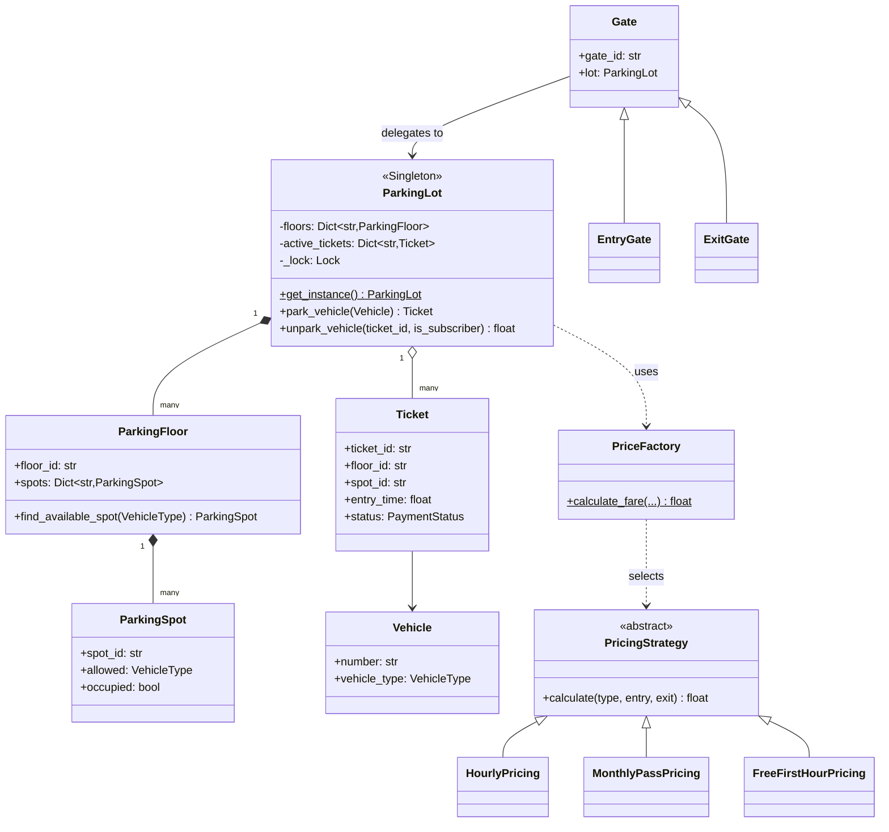
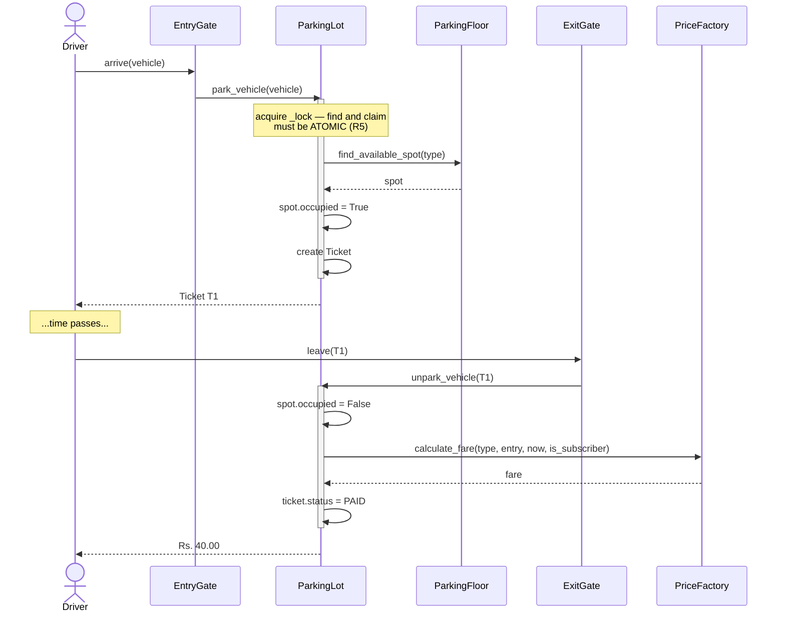

# 01 · Parking Lot

> **File:** [`parking_lot.py`](parking_lot.py) · **Run:** `python 01_parking_lot/parking_lot.py`
> **Difficulty:** ★☆☆☆☆ — start here. It is the "hello world" of LLD.

---

## The problem

Design a multi-floor parking lot. Vehicles arrive at an entry gate, are given a
spot and a ticket, and later leave through an exit gate, pay a fare, and free
the spot.

## Requirements

| # | Requirement |
|---|---|
| R1 | Multiple floors, each with many spots |
| R2 | Spots are typed (bike / car / truck); a vehicle needs a spot it fits |
| R3 | Entry gate issues a ticket; exit gate computes a fare and frees the spot |
| R4 | Fare rules must be swappable without editing the parking lot |
| R5 | Two cars arriving at the same instant must never get the same spot |

---

## Architecture

### The park → unpark flow

---

## Patterns used

| Pattern | Where | Why |
|---|---|---|
| **Strategy** | `PricingStrategy` + subclasses | New pricing rule = new class, no edits to `ParkingLot` (Open/Closed) |
| **Factory** | `PriceFactory` | Separates *which* rule applies from *how* it computes |
| **Singleton** | `ParkingLot` | One physical lot, so one object; every gate shares it |
| **Facade** | `EntryGate` / `ExitGate` | Gates own no logic, they just forward — so you can add gates freely |

---

## What was fixed vs. the original

| Issue | Original | Here |
|---|---|---|
| **Race condition** | No locking — two threads could claim the same spot | One `_lock` around the whole find-and-claim sequence |
| **Leaky singleton** | `__init__` guard; a direct `ParkingLot()` created an unregistered second lot | Guard moved into `__new__`, so `ParkingLot()` and `get_instance()` cannot disagree |
| **Magic sentinel** | `unpark` returned `-1` on a bad ticket | Raises `ValueError` — impossible to ignore by accident |
| **Dead state** | `PaymentStatus` was never set to `PAID` | Ticket is marked paid on exit |
| **Write-only code** | `-(-x // 3600)` ceiling trick | `math.ceil(seconds / 3600)` |
| **Unexplained zero** | `MonthlyPricing` returned `0` with no comment | Documented as "subscriber prepaid", plus a third strategy showing extension is cheap |

---

## Test yourself

1. Why is the lock around **both** the search and the claim, rather than just the claim?
2. `ParkingLot.__init__` is empty and `_init_state()` does the real work. What breaks if you move that code into `__init__`?
3. Add a `WeekendSurgePricing` strategy. How many existing files do you have to touch?
4. A car arrives and only truck spots are free. What happens, and how would you change it? (See the note in `find_available_spot`.)
5. The lot is one object with one lock. What breaks at 10,000 spots and 50 gates, and what would you change?

## Your notes

<!-- space for you -->
