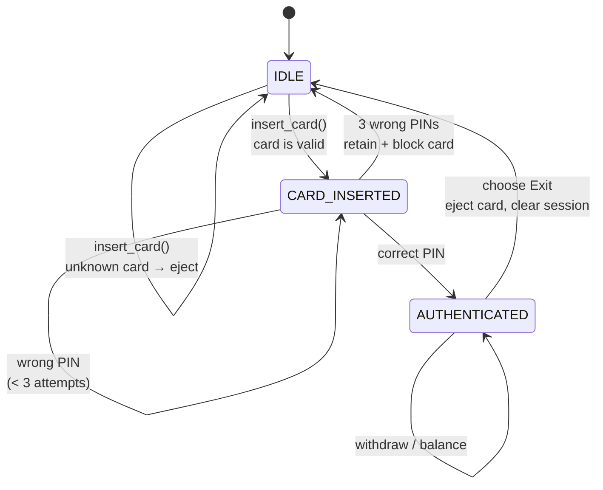
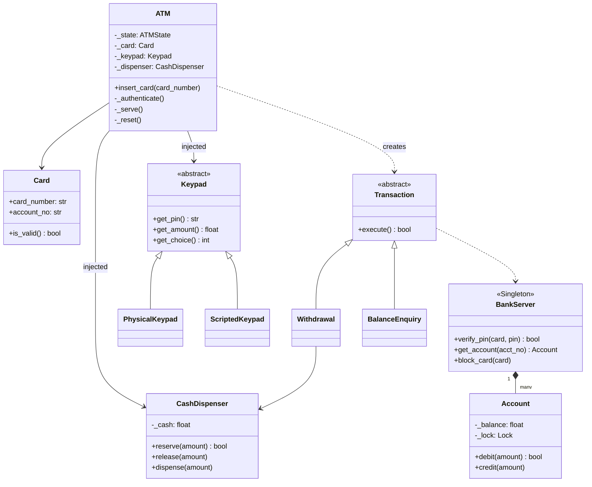
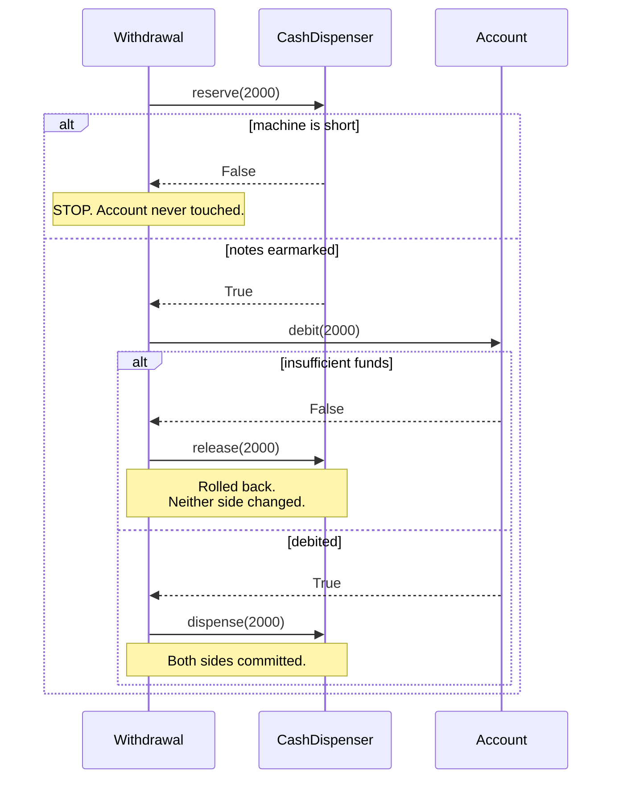

# 02 · ATM

> **File:** [`atm.py`](atm.py) · **Run:** `python 02_atm/atm.py`
> **Difficulty:** ★★☆☆☆ — the classic state-machine question.

---

## The problem

Design the software inside an ATM: insert card, enter PIN, withdraw cash or
check balance, take the card back.

## Requirements

| # | Requirement |
|---|---|
| R1 | Card in → PIN → menu → card out, never stuck half-way |
| R2 | Three wrong PINs and the machine swallows the card |
| R3 | Withdrawal fails cleanly if the account **or** the machine is short — and never debits money it did not hand out |
| R4 | New transaction types must be addable without rewriting the ATM |

---

## The one big idea: it is a state machine

Almost every bug in a naive ATM is *"an operation ran in a state where it
should have been impossible"*. Write the states down first; make every public
method start by checking the state.



---

## Architecture



### Withdrawal: the ordering that matters

The naive order loses money. Read this diagram carefully — it is the point of
the whole design.



**Why not just check-then-pay?**

```python
if dispenser.has(amount):     # 1. check
    if account.debit(amount): # 2. take the money
        dispenser.dispense()  # 3. hand over notes
```

Between 1 and 3 anything can go wrong — another transaction takes the last
notes, the cassette jams, the power dies. The account is already debited and
the customer has no cash. Reserve-first makes the failure recoverable.

---

## Patterns used

| Pattern | Where | Why |
|---|---|---|
| **State machine** | `ATMState` | Illegal operations become impossible, not just unlikely |
| **Singleton** | `BankServer` | One source of account truth |
| **Strategy / Command** | `Transaction` subclasses | Adding `Deposit` = adding a class |
| **Dependency injection** | `Keypad`, `CashDispenser` passed in | Makes the ATM testable and the demo runnable without typing |

---

## What was fixed vs. the original

| Issue | Original | Here |
|---|---|---|
| **Unrunnable demo** | `Keypad` called `input()` directly — the program just hung | `Keypad` is an interface; `ScriptedKeypad` replays keystrokes |
| **Money can vanish** | Debited the account, *then* dispensed, with no rollback | `reserve → debit → release-on-failure → dispense` |
| **No rollback possible** | `Account` had no `credit()` | Added, plus a lock |
| **Dead safety net** | `Card.is_valid()` existed but was never called | Wired into `insert_card()` |
| **Crash on typo** | `float(input(...))` with no guard | Re-prompts on bad input |
| **Session leak** | Previous customer's `Card` left on the machine after eject | `_reset()` clears session state |
| **Blocked card not blocked** | Card was "retained" but still worked | `BankServer.block_card()` actually blocks it |

---

## Test yourself

1. Why does `reserve()` come *before* `debit()` and not after?
2. `_authenticate()` calls `_serve()` on success. Draw the call stack for a full session. What would you change to flatten it?
3. Add a `Deposit` transaction. Which existing classes change?
4. Two ATMs share one `BankServer` and both withdraw from account ACC1 at the same instant. What protects the balance?
5. The dispenser tracks a total rupee amount. How would you change it to track denominations, and which method signatures change?

## Your notes

<!-- space for you -->
