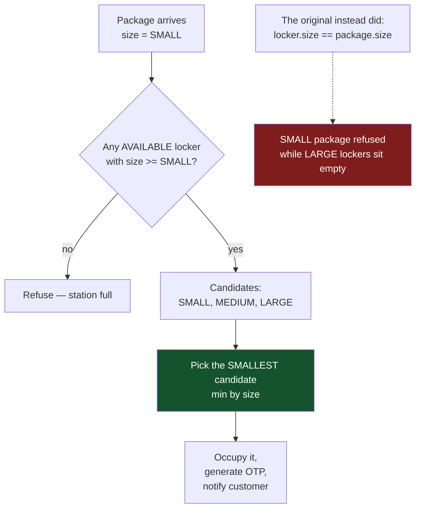
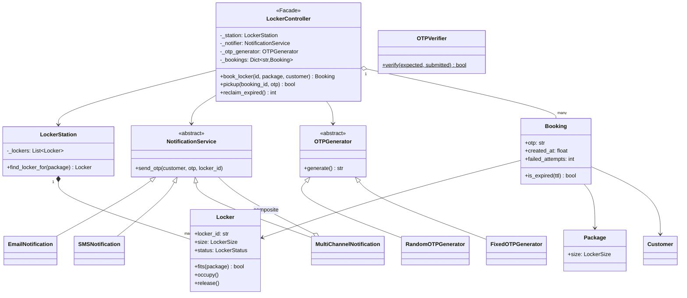
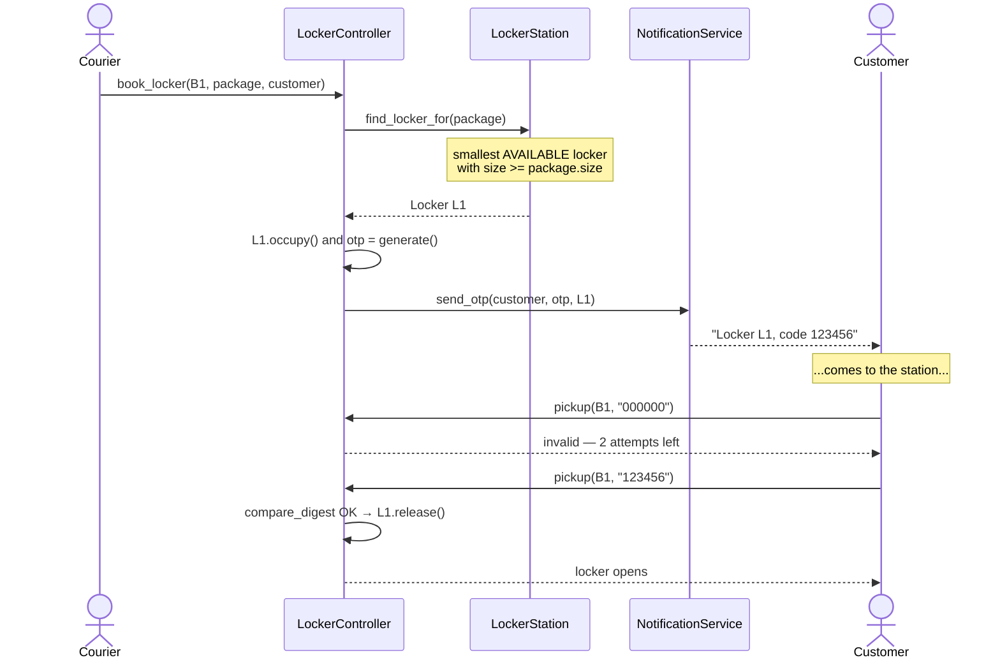

# 03 · Amazon Locker

> **File:** [`amazon_locker.py`](amazon_locker.py) · **Run:** `python 03_amazon_locker/amazon_locker.py`
> **Difficulty:** ★★☆☆☆ — resource allocation with a twist.

> ⚠️ **Provenance:** the upstream repo's Python file for this problem was
> **empty**. This is a port of the C++ version, plus the fixes below.

---

## The problem

Design the pickup-locker system. A courier drops a package into a locker; the
customer gets a one-time code and later opens that locker to collect it.

## Requirements

| # | Requirement |
|---|---|
| R1 | Lockers come in sizes; a package must go in a locker it fits in |
| R2 | Booking generates a one-time code (OTP) and notifies the customer |
| R3 | Pickup requires the right code |
| R4 | Uncollected packages expire so the locker is not blocked forever |
| R5 | Notification channel (email / SMS / push) must be swappable |

---

## The one big idea: best fit, not exact fit

> Find the **smallest** locker the package fits in — not a locker of exactly
> that size.

Exact-match wastes capacity: a small package is refused while three large
lockers stand empty. This is the part the original got wrong, and it is the
interesting part of the problem.

Why *smallest* and not *first that fits*? Handing a LARGE locker to a SMALL
package when a SMALL one is free means the next large package gets refused.
Greedy best-fit avoids that.

---

## Architecture

### Booking and pickup

---

## Patterns used

| Pattern | Where | Why |
|---|---|---|
| **Strategy** | `NotificationService` | Controller does not care if it is email, SMS, or a log line |
| **Strategy** | `OTPGenerator` | Random in production, fixed in the demo/tests |
| **Composite** | `MultiChannelNotification` | *Is* a notifier and *holds* notifiers — caller cannot tell one from many |
| **Facade** | `LockerController` | One small API over lockers + OTP + notification |

---

## What was fixed vs. the original

| Issue | Original | Here |
|---|---|---|
| **Exact-size allocation** | `locker.size == package.size` | Best fit: smallest locker with `size >= package.size` |
| **Shared password** | `generateOTP()` returned the literal `"1234"` for everyone | `secrets.randbelow`, 6 digits, per booking |
| **Timing attack** | OTP compared with `==` (early-exits on first mismatch) | `secrets.compare_digest` — constant time |
| **Unlimited guesses** | No attempt cap | 3 attempts, then the booking locks |
| **Lockers blocked forever** | No expiry | `Booking.is_expired()` + `reclaim_expired()` sweep |
| **Silent overwrite** | Re-using a booking id clobbered the old one, orphaning an occupied locker | Duplicate ids are rejected |

---

## Test yourself

1. Why is `LockerSize` an `IntEnum` rather than an `Enum`? What code gets longer if you change it?
2. `find_locker_for` is O(n). Sketch the O(log n) version for a station with 10,000 lockers.
3. Why `secrets.compare_digest` instead of `==`? Describe the attack in one sentence.
4. `MultiChannelNotification` implements the same interface it holds. What is that pattern called, and where else in this repo does it appear?
5. Two couriers book the last SMALL locker at the same instant. What goes wrong, and what would you add? (Compare with `01_parking_lot`.)

## Your notes

<!-- space for you -->
