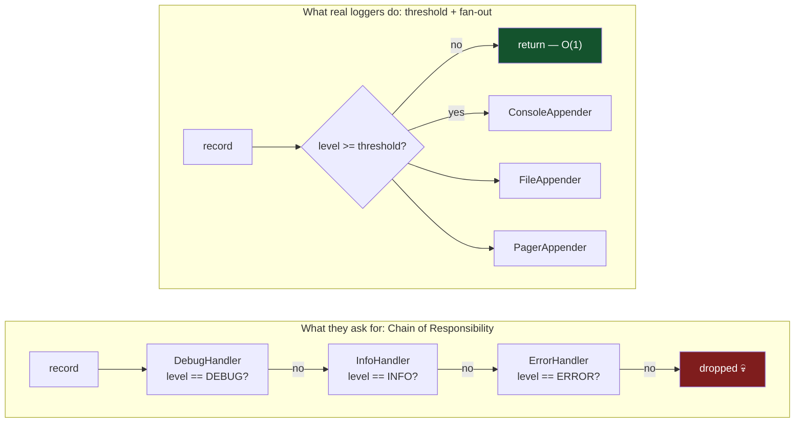
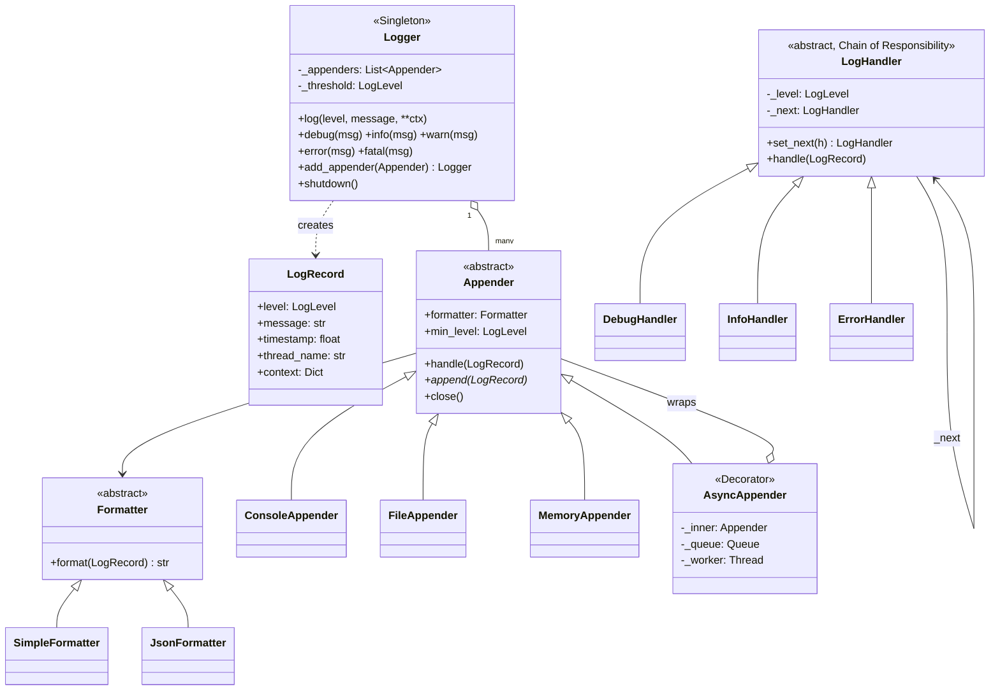
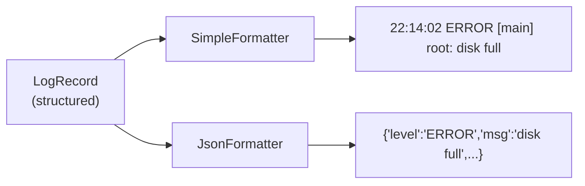

# 04 · Logger System

> **File:** [`logger_system.py`](logger_system.py) · **Run:** `python 04_logger_system/logger_system.py`
> **Difficulty:** ★★★☆☆ — the pattern they ask for is not the pattern you should use.

> ⚠️ **Provenance:** the upstream repo had **nothing** for this problem. The
> Python and Java files were empty, and `loggersystem.cpp` was a copy-paste of
> the Amazon Locker code — the wrong program under the right filename. This
> file is written from scratch.

---

## The problem

Design a logging library. `log.info("...")`, `log.error("...")`. Messages below
a configured severity are dropped; the rest are formatted and written to one or
more destinations.

## Requirements

| # | Requirement |
|---|---|
| R1 | Severity levels with an order: DEBUG < INFO < WARN < ERROR < FATAL |
| R2 | A configurable threshold; anything below it is dropped cheaply |
| R3 | Many destinations at once (console **and** file **and** …) |
| R4 | Message layout swappable independently of the destination |
| R5 | One shared logger for the whole app |
| R6 | Safe from many threads, with no interleaved half-lines |

---

## The one big idea — and the trap

Interviewers ask this problem **hoping you say "Chain of Responsibility"**. So
build it. But be ready for the follow-up, because CoR is the *wrong tool here*
and knowing why is the actual signal.



**Four reasons the chain loses:**

1. **Lookup cost.** The chain is a linked list, so a FATAL record walks every
   handler ahead of it — O(n). A threshold compare is O(1).
2. **Levels are a total order, not an unknown set.** CoR earns its keep when
   you genuinely cannot tell which handler applies without asking each in turn
   (approval limits, HTTP middleware, exception dispatch). `ERROR >= WARN`
   needs no search.
3. **One handler wins.** The chain stops at the first match, but logging wants
   **fan-out** — an ERROR goes to console *and* file *and* the pager. Make
   every handler forward after handling and it is not a chain any more, it is
   a broadcast list with extra steps. Which is Observer.
4. **Configuration.** Users configure `threshold = WARN`, not "rebuild the
   chain, omitting DEBUG and INFO".

> Say both halves. *"Here is the CoR you asked for, and here is why real
> loggers don't use it"* is a better answer than either half alone.

---

## Architecture



### Why `LogRecord` is data, not a string

The tempting shortcut is to pass a finished string around:

```python
appender.write("2026-01-01 ERROR [main] disk full")   # ✗
```

Do that and you throw away structure at the first step. The file appender can
no longer emit JSON, the network appender cannot index by level, and the
alerting appender has to regex the timestamp back out. Keep the record
structured and let each **Formatter** decide the layout at the last possible
moment.



### Formatter × Appender is a deliberate 2-axis split

With 3 formatters and 4 destinations you write **7 classes, not 12**. Combining
them into `JsonFileAppender`, `JsonConsoleAppender`, … is the class explosion
this split exists to prevent. `AsyncAppender` (Decorator) is the same idea
again: it composes with *any* appender instead of needing
`AsyncFileAppender`, `AsyncConsoleAppender`, …

---

## Patterns used

| Pattern | Where | Why |
|---|---|---|
| **Chain of Responsibility** | `LogHandler` + subclasses | The answer interviewers expect — build it, then critique it |
| **Strategy** | `Formatter` | Layout decided independently of destination |
| **Observer** | `Logger` → N `Appender`s | One event, many destinations |
| **Singleton** | `Logger` | One logger per process |
| **Decorator** | `AsyncAppender` | Makes *any* appender non-blocking without subclassing each one |

---

## Things worth stealing from this file

**The early return is why `log.debug()` is free in production:**

```python
if level < self._threshold:
    return          # no record built, no string formatted, no lock taken
```

Corollary for callers — never write this:

```python
log.debug("state = " + expensive_dump())   # ✗ expensive_dump() runs anyway
```

**Async logging can lose the last few records** if the process is killed before
the queue drains — exactly the records you want after a crash. Mitigations:
bound the queue, flush on shutdown, keep FATAL synchronous. State the
trade-off out loud; it is not a bug you hide.

**Backpressure is a decision, not an oversight.** When the queue is full you
can (a) block the caller, (b) drop the new record, or (c) drop the oldest.
This file drops and announces it, because a logger must never be the thing
that stalls the application.

---

## Test yourself

1. Why is the threshold check in `Logger.log()` and not inside each appender? (Both exist here — what does each one buy you?)
2. A record must never appear half-written when 8 threads log at once. Where exactly is the lock, and why *there*?
3. Give a problem where Chain of Responsibility genuinely *is* the right answer. What makes it different from log levels?
4. `AsyncAppender` wraps an `Appender` and *is* an `Appender`. Name three other classes in the standard library shaped like that.
5. The process is SIGKILLed with 400 records in the async queue. What is lost, and what would you change if that were unacceptable?

## Your notes

<!-- space for you -->
