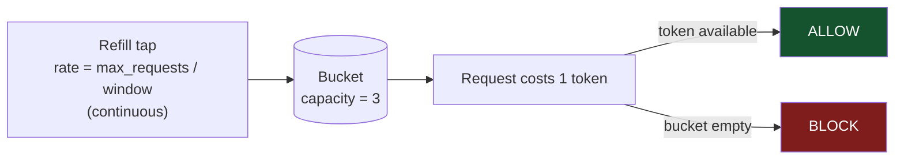
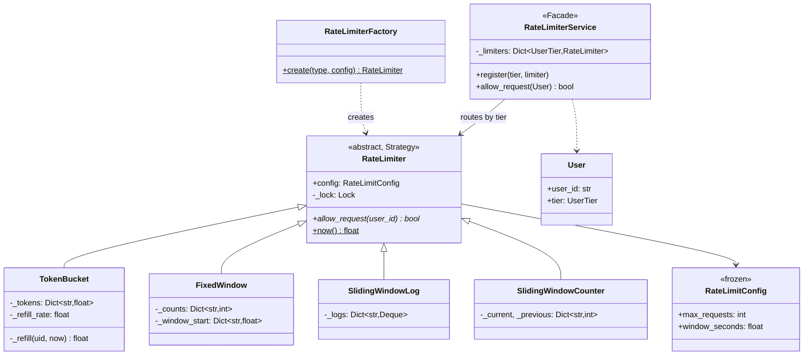

# 05 · Rate Limiter

> **File:** [`rate_limiter.py`](rate_limiter.py) · **Run:** `python 05_rate_limiter/rate_limiter.py`
> **Difficulty:** ★★★☆☆ — mostly an algorithms question wearing an LLD hat.

> ⚠️ **Provenance:** the upstream repo's Python file was **empty**. This is a
> port of the C++ version with the algorithm bugs below fixed.

---

## The problem

Allow a user at most **N requests per T seconds**; reject the rest. Different
user tiers get different limits and may use different algorithms.

## Requirements

| # | Requirement |
|---|---|
| R1 | Per-user counting, not global |
| R2 | Several algorithms, swappable at configuration time |
| R3 | Per-tier configuration (free: 3/min, premium: 100/min) |
| R4 | Thread-safe — a limiter that miscounts under load is worthless |

---

## The four algorithms in one table

| Algorithm | Memory/user | Allows bursts? | Boundary bug? | Exact? |
|---|---|---|---|---|
| **Token Bucket** | O(1) | ✅ yes | no | no |
| **Fixed Window** | O(1) | no | ⚠️ **yes (2× spike)** | no |
| **Sliding Window Log** | O(N requests) | no | no | ✅ **yes** |
| **Sliding Window Counter** | O(1) | no | no | approximate |

Read that top to bottom and you have the whole trade-off space: you are trading
**memory for accuracy**, and choosing whether bursts are a feature or a bug.

---

## The two ideas you must be able to draw

### 1. Token bucket — why it is the default choice



It **allows bursts**. A user who has been idle accumulates a full bucket and
can fire all 3 requests at once, then is throttled to the steady rate. That
matches how real clients behave — a page load makes 5 API calls at once and
then goes quiet — which is why AWS, Stripe and nginx all use a token bucket.

### 2. Fixed window — the boundary bug

This is the standard follow-up question. Limit is 5/minute:

```mermaid
gantt
    dateFormat HH:mm:ss
    axisFormat %H:%M:%S
    title 10 requests in 2 seconds, and every one is "legal"
    section Window 1 (11:59:00–12:00:00)
    5 requests            :crit, a1, 11:59:59, 1s
    section Window 2 (12:00:00–12:01:00)
    5 more requests       :crit, a2, 12:00:01, 1s
```



Both bursts are legal — they are in different windows — but the user just made
**10 requests in 2 seconds** against a limit of 5 per minute. Fixed window
permits up to **2× the intended rate** across any boundary.

- **Sliding Window Log** removes this *exactly* — at O(N) memory per user.
- **Sliding Window Counter** removes it *approximately* — at O(1) memory. It
  exists precisely because of this bug.

### 3. Sliding window counter — the practical compromise

```
elapsed  = how far we are into the current window
weight   = 1 - elapsed / window        # 1.0 at the start, 0.0 at the end
estimate = previous_count * weight + current_count
```

Worked example, limit 100/min, 30s into the current minute:

```
previous minute saw 80, current has 20 so far
weight   = 1 - 30/60 = 0.5
estimate = 80*0.5 + 20 = 60      →  under 100, allow
```

**Where it is wrong:** it assumes the previous window's requests were spread
evenly. If all 80 landed in the last second, the true sliding count is 100, not
60. In practice the error is a couple of percent — Cloudflare famously runs on
this. You buy 99% of the accuracy for 0.001% of the memory.

---

## Architecture



---

## Patterns used

| Pattern | Where | Why |
|---|---|---|
| **Strategy** | `RateLimiter` + 4 subclasses | Swap algorithms with a config change, no caller edits |
| **Factory** | `RateLimiterFactory` | Dict registry, not an if/elif ladder — no branch to forget |
| **Facade** | `RateLimiterService` | Gateway asks "may this user proceed?" and sees no algorithm |

---

## What was fixed vs. the original

| Issue | Original | Here |
|---|---|---|
| **Token bucket didn't refill smoothly** | `refill = (elapsed / window) * maxRequests` with **integer** division → 0 for the first 59 of 60 seconds, then a jump to full. That is a fixed window, not a token bucket | Float tokens, continuous `elapsed * refill_rate` |
| **Silent rate drift** | `lastRefill = t` even when refill rounded to 0, discarding the elapsed remainder on every call → user permanently throttled below their configured rate | No rounding, so nothing to discard |
| **Wall-clock time** | `time(nullptr)` — NTP corrections and DST make it jump backwards (free reset for everyone) or forwards (everyone's budget expires at once) | `time.monotonic()` |
| **1-second resolution** | Integer seconds — a 100 ms window was unrepresentable | Float seconds |
| **Counter under-counted** | `(int)(prevCount * weight)` truncated, letting extra requests through | Kept as a float |
| **Stale previous window** | A user idle for an hour still paid for requests made an hour ago | Zeroed when `elapsed >= 2 * window` |
| **`tokens_left` lied** | — | Refills before reporting; an observability method must not lie about the thing it observes |

---

## One policy decision worth naming out loud

```python
limiter = self._limiters.get(user.tier)
if limiter is None:
    return True          # FAIL OPEN
```

**Fail-open** keeps the product working when the limiter config is missing.
**Fail-closed** protects the backend but can take the whole site down over a
config typo. For rate limiting, fail-open is the usual call — for
**authentication it is the opposite**, and choosing wrong there is a security
incident. Whichever you pick, say which and why.

---

## Test yourself

1. Which algorithm would you pick for a login endpoint, and which for a public
   read API? Justify each in one sentence.
2. Why `time.monotonic()` and not `time.time()`? Give a concrete failure.
3. `SlidingWindowLog` uses a `deque`. What breaks if you use a `list`?
4. Limit 10,000/hour × 1 million users. Compute the memory for the log
   algorithm. Now for the counter.
5. These limiters keep state in a process dict. What breaks with 20 servers
   behind a load balancer, and what would you replace the dict with?

## Your notes

<!-- space for you -->
