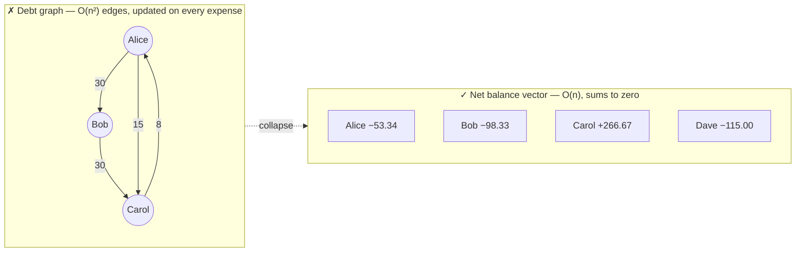
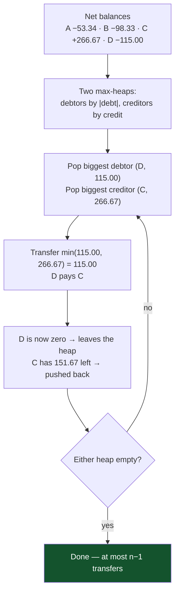
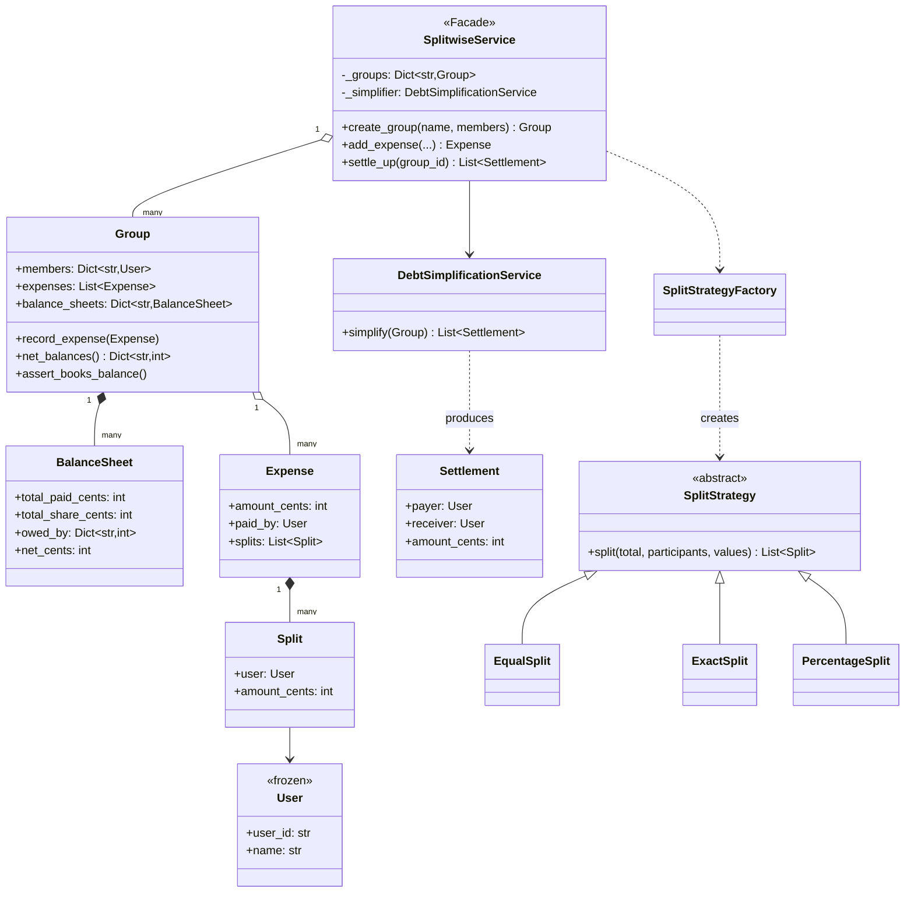
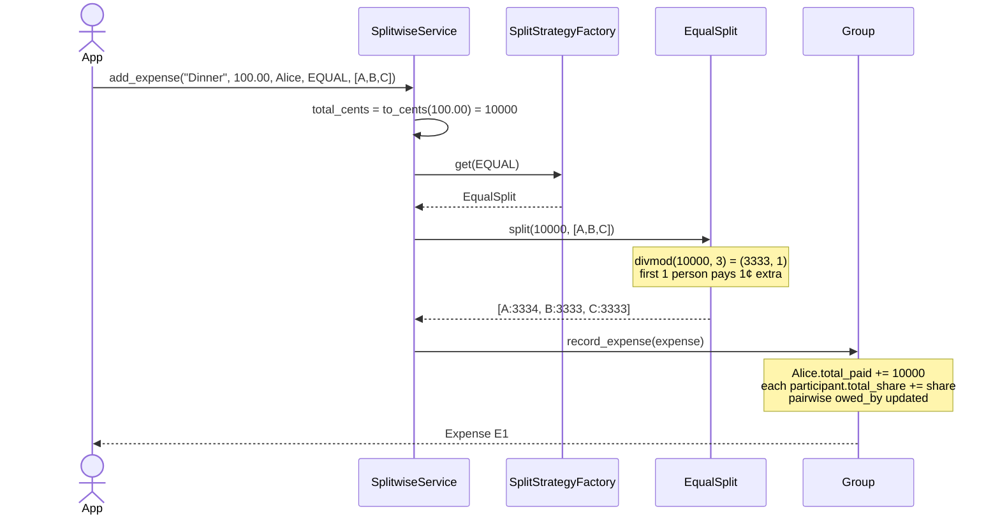

# 06 · Splitwise

> **File:** [`splitwise.py`](splitwise.py) · **Run:** `python 06_splitwise/splitwise.py`
> **Difficulty:** ★★★★☆ — the only one here with a genuinely interesting algorithm.

> ⚠️ **Provenance:** the upstream Python file had the class skeleton but every
> interesting method was a stub — `def simplify_debt(self, group): pass` and
> `# TODO: update balance_sheet`. The data model existed; the behaviour did
> not. Both are implemented here.

---

## The problem

A group of friends share expenses. One person pays; the cost is split among
several. Track who owes whom, and settle up with as few transfers as possible.

## Requirements

| # | Requirement |
|---|---|
| R1 | Split EQUALLY, by EXACT amounts, or by PERCENTAGE |
| R2 | Maintain a running balance per person |
| R3 | Reject an expense whose splits do not add up |
| R4 | "Simplify debts": settle the group in the fewest transfers |
| R5 | Never lose a cent to rounding |

---

## Big idea 1: store net balances, not a debt graph

Do **not** store a graph of "A owes B 30, B owes C 30".



**The invariant:** every net balance in a group always sums to **exactly
zero**. Money is never created or destroyed by an expense — it only moves.
That invariant is your assertion, your test, and your proof the books are
straight. It is a live `assert_books_balance()` in this file.

## Big idea 2: money is an integer number of cents

```python
>>> 0.1 + 0.2 == 0.3
False
```

Floats are binary fractions; `0.1` is not exactly representable, the same way
`1/3` is not exactly representable in decimal. Add a few thousand and your
books are off by a cent — the kind of bug found by an auditor, not by a test.

Every real payments system stores money as an **integer of the smallest unit**.
Two consequences in this file:

- Split validation is a plain `==`, with no epsilon fudge factor.
- `EqualSplit` hands the remainder out one cent at a time: 1000 ¢ / 3 people
  becomes 334 + 333 + 333, not 333 × 3 = 999 with a cent evaporated.

---

## Big idea 3: debt simplification

After the ledger runs, split everyone into **debtors** (net < 0) and
**creditors** (net > 0). Greedily pair the biggest of each:



**Why it terminates quickly:** every iteration zeroes at least one person, so
with *n* people there are at most **n−1** transfers. The naive "pay back each
edge you owe" can need O(n²).

**Is it optimal? No — and say so.** Finding the true minimum number of
transfers requires partitioning the balances into the maximum number of
zero-sum subsets, which is **NP-hard** (it contains subset-sum). Greedy gives
≤ n−1 transfers, is O(n log n), and is what Splitwise itself ships.

> *"Greedy, n−1 transfers, exact optimum is NP-hard, here is the
> counter-example"* is a much stronger answer than claiming optimality.

---

## Architecture



### Adding an expense



---

## Patterns used

| Pattern | Where | Why |
|---|---|---|
| **Strategy** | `SplitStrategy` + 3 subclasses | Each split rule validates its own input — a new type cannot forget to |
| **Factory** | `SplitStrategyFactory` | `SplitType` → strategy |
| **Facade** | `SplitwiseService` | The API the app calls; everything else is an implementation detail |

---

## What was implemented / fixed vs. the original

| Issue | Original | Here |
|---|---|---|
| **The core feature was a stub** | `def simplify_debt(self, group): pass` | Greedy max-heap settlement, ≤ n−1 transfers |
| **Ledger never updated** | `add_expense` had `# TODO: update balance_sheet` — the app tracked nothing | `Group.record_expense()` updates aggregate *and* pairwise books in one place |
| **`BalanceSheet` unused** | Declared, never populated | It is the ledger |
| **Only 2 split types, neither validated** | EQUAL / PERCENTAGE enum, no logic | 3 types, each validating; bad input raises with a message |
| **Float money** | `amount: float` throughout | Integer cents, with `to_cents` / `to_display` as the only boundary |
| **Bare `KeyError`** | `self.groups[group_id]` | `ValueError` naming the bad id |
| **No invariant check** | — | `assert_books_balance()`, called in the demo |

---

## Test yourself

1. Why net balances instead of a debt graph? Give the complexity of each.
2. 1000 ¢ split 3 ways. What does naive integer division lose, and how does `EqualSplit` avoid it?
3. Why does `ExactSplit` compare with `==` while `PercentageSplit` uses an epsilon? (Hint: one of them is money.)
4. Produce a 4-person balance set where greedy needs more transfers than the true optimum.
5. `heapq` is a min-heap. Trace the signs in `DebtSimplificationService.simplify` — why do debtors need no negation but creditors do?
6. Add "settle up partially: Bob pays Carol 50". Which classes change?

## Your notes

<!-- space for you -->
