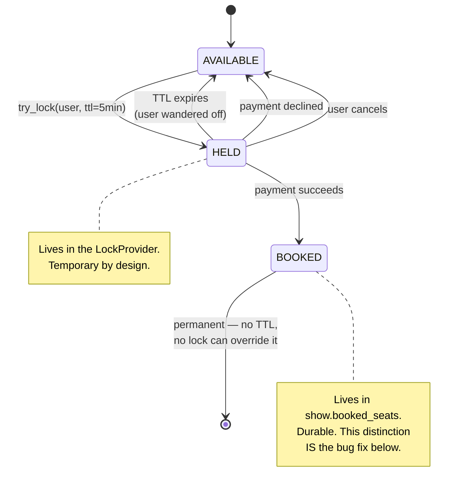
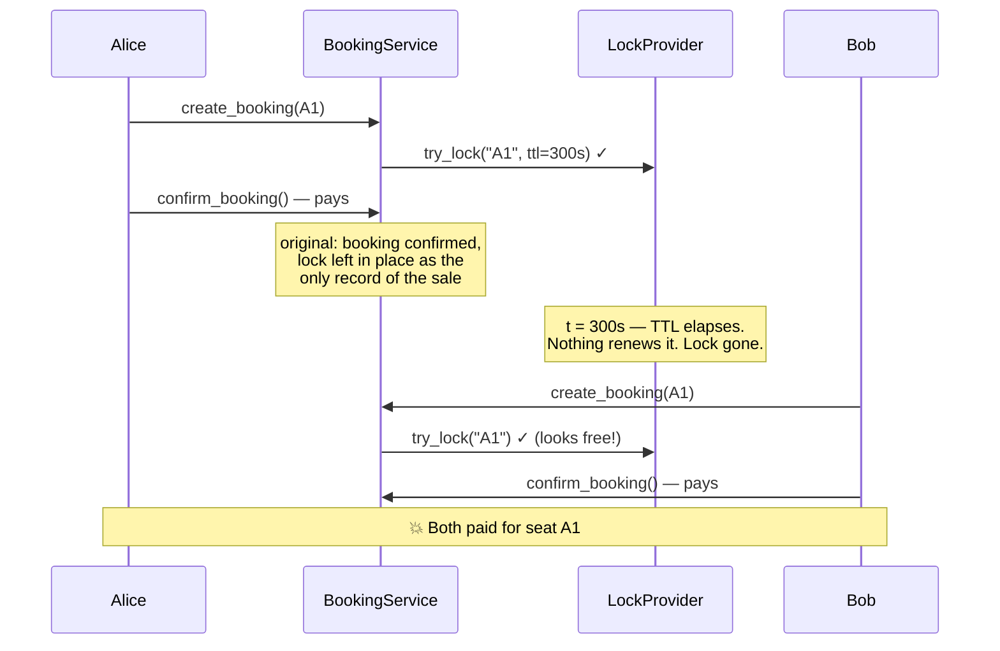
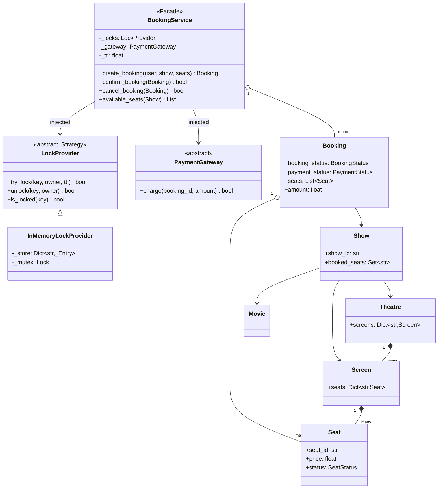

# 07 · BookMyShow

> **File:** [`book_my_show.py`](book_my_show.py) · **Run:** `python 07_book_my_show/book_my_show.py`
> **Difficulty:** ★★★★☆ — a concurrency problem in a UI costume.

---

## The problem

Design movie ticket booking. A user picks seats for a show, holds them while
they pay, and either confirms or loses the hold.

## Requirements

| # | Requirement |
|---|---|
| R1 | Theatres have screens; screens have seats; shows run on a screen |
| R2 | **Two users must never get the same seat** — this is the entire problem |
| R3 | A user who starts booking and wanders off must not hold seats forever |
| R4 | Payment failure releases the seats immediately |
| R5 | Multi-seat bookings are all-or-nothing |

---

## The one big idea: the two-phase seat hold

Seat selection and payment are separated by 30–300 seconds of a human typing
card details. You cannot hold a database transaction open that long, and you
cannot leave the seat free or two people will pay for it.

The answer is a **soft lock with a TTL**:



**The lock is temporary; the booking is permanent.** Confusing those two is the
bug the original had.

---

## 🐛 The headline bug: double-booking, five minutes after every sale

The original relied on the **lock alone** to keep a sold seat sold. But locks
expire — that is their entire purpose.



**The fix** is one extra check and one extra write:

```python
# create_booking — permanent check FIRST, no lock can override it
if seat.seat_id in show.booked_seats:
    raise SeatUnavailableError(...)

# confirm_booking — write the durable fact BEFORE releasing the hold
seat.status = SeatStatus.BOOKED
booking.show.booked_seats.add(seat.seat_id)
```

> **The lesson, generalised:** permanent facts never live in something with a
> TTL. A cache entry, a lock, a session — none of them are a system of record.

---

## Architecture



### Why `LockProvider` is an interface

In a single process a dict plus a mutex is enough. In production there are 20
booking servers behind a load balancer, and a lock in one server's memory means
nothing to the other 19. You need a lock that lives **outside** the process —
Redis `SET NX PX`, or a DB row with a uniqueness constraint.

Putting that behind an interface now makes the swap one line later. The
in-memory implementation is not a toy — it is the test double.

### Availability is per **show**, not per seat

Seat A1 can be sold for the 6pm show and free for the 9pm show. That is why
every lock key is `show:{show_id}:seat:{seat_id}` and why `booked_seats` lives
on the `Show`.

---

## Patterns used

| Pattern | Where | Why |
|---|---|---|
| **Strategy** | `LockProvider` | In-memory now, Redis in production, one line to swap |
| **Facade** | `BookingService` | The whole two-phase protocol behind two methods |
| **State** | `BookingStatus`, `SeatStatus`, `PaymentStatus` | An explicit lifecycle you can draw |
| **Dependency injection** | lock provider + payment gateway | Lets the demo show both success and decline paths |

---

## What was fixed vs. the original

| Issue | Original | Here |
|---|---|---|
| **Double booking** | Confirmed sale recorded only as a lock, which expires | `show.booked_seats` — durable, checked first |
| **Dead state** | `Seat.status` was set at construction and never updated | Wired into the confirm path |
| **Stringly-typed states** | `"pending"`, `"paid"`, `"available"` — a typo silently means "not confirmed" | Three enums |
| **Unlock stole others' locks** | `unlock(key)` deleted whatever was there, so a stalled request could release the lock of the user who took it next | `unlock(key, owner_id)` — compare-and-delete, same reason Redlock insists on a Lua CAS |
| **No way to give up** | Only the TTL released seats, even when the user explicitly cancelled | `cancel_booking()` |
| **Charged on an expired hold** | Confirm did not re-check the hold | Verifies every hold is still live *before* charging |
| **`is_expired` unused** | Declared on the interface, never called | Folded into `try_lock` / `is_locked` |
| **Untyped errors** | Bare `RuntimeError` | `SeatUnavailableError`, so callers can catch exactly this |
| **Unused import** | `Optional` imported, never used | Removed |

---

## Test yourself

1. Why does a confirmed sale need durable state *and* a lock? What is each one for?
2. `unlock` takes an `owner_id`. Walk through the 5-step scenario where omitting it lets a third user steal a seat.
3. A user locks 3 seats and the 3rd fails. What happens to the first 2, and what would go wrong without the rollback?
4. What is the right TTL? What breaks if it is 10 seconds? If it is an hour?
5. Swap `InMemoryLockProvider` for Redis. Which methods change, and what does `try_lock` become? (Hint: one command with two flags.)
6. The service holds `_bookings` in a process dict. What breaks with 20 servers?

## Your notes

<!-- space for you -->
