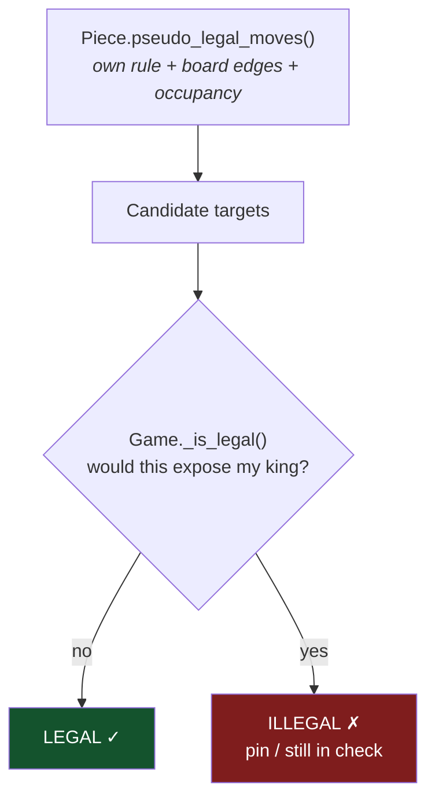
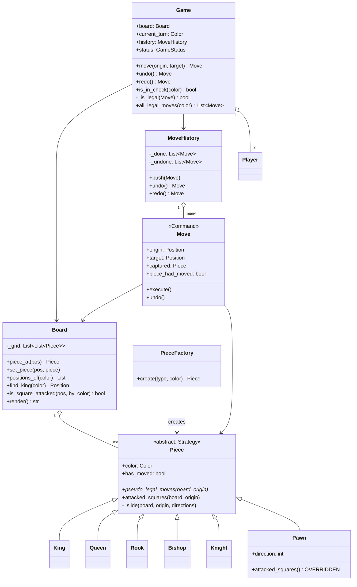
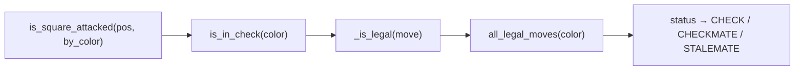

# 08 · Chess

> **File:** [`chess_game.py`](chess_game.py) · **Run:** `python 08_chess_game/chess_game.py`
> **Difficulty:** ★★★★★ — the biggest one here, and the best payoff.

> ⚠️ **Provenance:** the upstream repo's Python file was **empty**, and the C++
> version had this for every single piece:
> ```cpp
> vector<pair<int,int>> getValidMoves() override { return {}; }
> ```
> Six classes, six empty methods. The Strategy pattern was *declared* but never
> filled in, so the "game" accepted any move at all — a pawn to h8, a king
> capturing its own queen. The movement rules **are** the problem; this file
> implements them.

---

## The problem

Two-player chess: a board, six kinds of piece with different movement rules,
turn alternation, undo/redo, and detection of check, checkmate and stalemate.

## Requirements

| # | Requirement |
|---|---|
| R1 | Each piece type moves by its own rule |
| R2 | You cannot capture your own pieces, or move off the board |
| R3 | You cannot make a move that leaves **your own** king in check |
| R4 | Detect check, checkmate and stalemate |
| R5 | Undo and redo, any number of moves deep |

---

## Big idea 1: pseudo-legal vs legal

A piece knows **how it moves**. Only the game knows **whether that move is
allowed**. A pinned knight moves in an L like any other knight — but moving it
would expose its king, so the game rejects it.



Keeping those two questions in different classes is what stops every piece from
needing to know about kings. A `Knight` that also reasoned about pins would be
unreadable — and you would write that reasoning six times.

## Big idea 2: legality is tested by simulation

There is no clever formula. **You make the move, ask "is my king attacked?",
and take it back.**

```python
def _is_legal(self, move):
    move.execute()
    try:
        return not self.is_in_check(move.piece.color)
    finally:
        move.undo()          # ALWAYS undone, even on exception
```

This one method handles **pins, discovered checks, moving out of check,
blocking a check, and capturing the checker** — without a single special case
for any of them. Five rules for the price of none.

And it is why `Move` must be a perfectly reversible **Command**: the same
machinery then powers undo/redo for free.

---

## Architecture



### `is_square_attacked` is the engine of everything



Check, checkmate, stalemate and legal-move filtering are **all** expressed in
terms of that one method.

### Status is two booleans

|  | no legal moves | has legal moves |
|---|---|---|
| **in check** | `CHECKMATE` | `CHECK` |
| **not in check** | `STALEMATE` | `ACTIVE` |

Getting stalemate wrong (scoring it as a loss) is the classic bug. It is a
**draw**, and it is the only cell in that table that surprises people.

### Why the Pawn overrides `attacked_squares()`

Five pieces attack exactly where they move. The pawn does not: it **moves**
straight ahead but **captures** diagonally.

```
        move                 attack
      . P̲ .                . x x .          P = pawn
      . ↑ .                 . ↑ .           ↑ = forward push (NOT an attack)
      . P .                 . P .           x = attacked square
```

Using the move list for attack detection is a classic chess-engine bug: a king
would refuse to step onto a square merely "occupied" by a pawn's forward push.

---

## Patterns used

| Pattern | Where | Why |
|---|---|---|
| **Strategy** | `Piece` + 6 subclasses | One movement algorithm each; `_slide()` shared by the 3 sliding pieces so Rook/Bishop/Queen are 2 lines apiece |
| **Command** | `Move` | Executable *and reversible* — which is what makes simulation-based legality possible |
| **Factory** | `PieceFactory` | Dict registry, not a switch |
| **Singleton** | `Game` — **with a caveat** | See below |

### The Singleton caveat, worth saying out loud

The original made `Game` a hard singleton. That is fine for one desktop game
and **wrong for a server**, which runs thousands of games at once. A singleton
is a global variable in a costume; reach for it only when the thing really is
unique in the process (a connection pool, a logger, the one physical parking
lot in `01`).

So here the constructor is public — make as many `Game`s as you like — and
`get_instance()` is offered *separately* for the single-game case. You get the
convenience without the design being locked to it.

---

## What was fixed vs. the original

| Issue | Original | Here |
|---|---|---|
| **No rules at all** | `getValidMoves() { return {}; }` × 6 | Full move generation for all six pieces |
| **No check detection** | `status` was set once and never changed | `is_square_attacked` → check → checkmate / stalemate |
| **Could capture own pieces** | No colour test on the target | Occupancy checked in every generator |
| **`undo()` corrupted `has_moved`** | Restored the squares but not the flag — so an undone pawn permanently lost its double-step, *and* since legality testing undoes constantly, every piece corrupted within a few turns | `piece_had_moved` saved and restored |
| **Two divergent histories** | Pushed to `cmdHistory` **and** `board->moveHistory`; undo popped only one | One `MoveHistory`, owned by the `Game` |
| **Silent rejection** | Illegal move just `return`ed — indistinguishable from a legal no-op | `IllegalMoveError` with the reason |
| **No promotion** | — | Pawn auto-queens on the last rank, and `undo` puts the *pawn* back |
| **Pointless `Cell` class** | 64 objects each storing the coordinates you used to look them up | Plain nested list + `(row, col)` tuples |

**Deliberately not implemented,** with notes in the code saying what each would
take: **castling** (king + rook unmoved, empty between, king not in/through
check) and **en passant** (needs the game to remember the last move).
Naming what you left out and why is worth more in an interview than silently
omitting it.

---

## Test yourself

1. What is the difference between a pseudo-legal and a legal move? Give an example that is one and not the other.
2. `_is_legal` uses `try/finally`. What breaks without the `finally`?
3. Rook, Bishop and Queen are two lines each. Where did the code go?
4. Why does `Pawn` override `attacked_squares()` when no other piece does?
5. Checkmate and stalemate differ by exactly one boolean. Which one?
6. Implement castling. Which classes change, and what new state do you need?
7. `is_square_attacked` is O(pieces × moves). What would you change first to make this a real engine?

## Your notes

<!-- space for you -->
