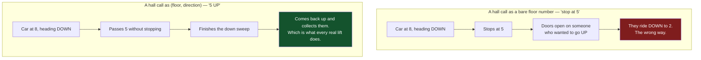
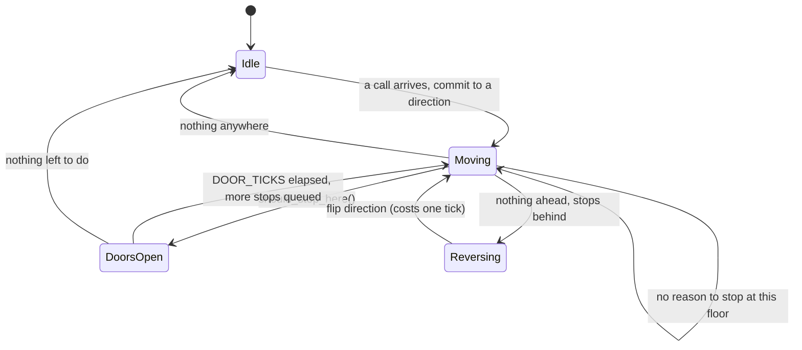
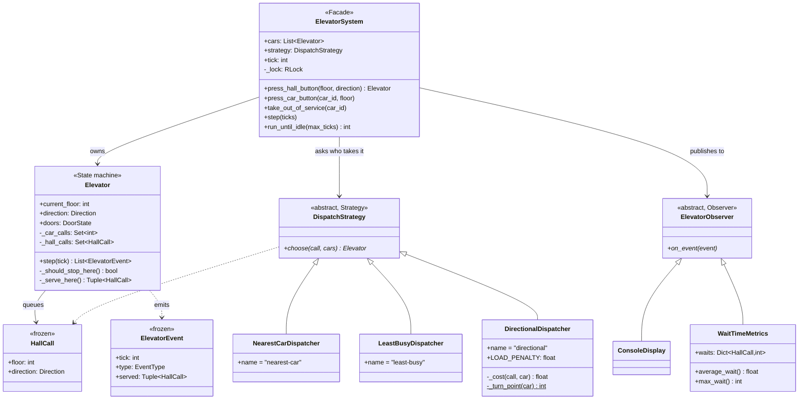

# 09 · Elevator System

> **File:** [`elevator_system.py`](elevator_system.py) · **Run:** `python 09_elevator_system/elevator_system.py`
> **Difficulty:** ★★★★☆ — a scheduling problem wearing an LLD hat.

> 🆕 **New in this fork.** This design is not one of the eight from upstream.
> It is here because it is the classic question the other eight leave
> uncovered: one where the interesting bug is not a race or a rounding error
> but a **policy that is merely plausible**.

---

## The problem

A building with **F floors** and **N cars**. People press UP/DOWN buttons in
the hallway; people inside a car press floor buttons. Decide **which car
answers each hall call**, and **in what order each car makes its stops**.

## Requirements

| # | Requirement |
|---|---|
| R1 | Two kinds of request — hall call `(floor, direction)` and car call `floor` |
| R2 | A car answers a hall call only if it will be travelling that way when it arrives |
| R3 | Dispatch policy is swappable — it is the part an operator tunes |
| R4 | Cars can be taken out of service without stranding their passengers |
| R5 | Thread-safe — every button in the building is a concurrent caller |
| R6 | Deterministic and testable — no sleeps, no wall clock |

---

## The one thing to take away

> **The nearest car is not the soonest car.**

Every naive dispatcher scores cars by `|car_floor - call_floor|`, because
distance is the number sitting right there. But nobody is waiting for a
*distance*. They are waiting for a *time*, and a car one floor away that is
accelerating away from you with eight stops queued is minutes further off than
an idle car three floors below.

Scoring in time needs two facts that distance throws away: **which way the car
is going**, and **how much work it already has**.

---

## Why a hall call is a pair, not a number

This is the modelling decision the whole design hangs on.



A car call needs no direction — someone already inside is going wherever the
car goes. A hall call without a direction is not a weaker request, it is an
**unschedulable** one: you cannot ask "will this car be useful to them?" if you
do not know what they want.

Making it a frozen dataclass buys deduplication for free: hall calls live in a
`set`, so thirty people jabbing UP in the lobby is thirty presses of **one**
call. Model it as a list entry instead and that is a bug you have to remember
not to write.

---

## How one car moves: LOOK



Stops are held in **sets, not queues** — a deliberate rejection of FCFS.
Serving in press order would send a car `1 → 9 → 2 → 8`: correct, fair, and
unusable. Order is dictated by **geometry**, not arrival time.

### `should_stop_here()` — the three rules

The car stops at the floor it is standing on if:

| | Rule | Why |
|---|---|---|
| **a** | Someone inside asked for this floor | Direction is irrelevant; they are already aboard |
| **b** | There is a hall call here **going our way** | The whole point of R2 |
| **c** | Nothing is ahead of us, and there is a hall call here going the **other** way | We are about to turn around, so "the other way" *is* our next direction |

**Rule (c) is the one people miss.** Without it, a car sweeping up to its top
stop sails past the person on that floor waiting to come down, reverses one
floor higher, and comes back for a stop it was already parked at. With it, the
ends of a sweep are exactly where a car flips direction and collects the
reversal traffic. That is what LOOK *means*.

The car flips its direction **before** the doors open, so the indicator above
the doors is truthful — you step in, see `v`, and know this one is going down.

---

## The three dispatch policies

| Policy | Scores by | Fails when |
|---|---|---|
| **Nearest Car** | distance | the near car is busy, or driving away from you |
| **Least Busy** | queue length | the idle car is 20 floors away |
| **Directional** | estimated travel time | traffic saturates the fleet — see below |

The two single-number policies are each obviously reasonable, they **disagree**,
and they are both beaten by combining their inputs. That is the argument for
`DispatchStrategy` being a real interface and not premature abstraction.

### The directional cost model

```
Case 1 — car is idle, or already coming toward you going your way:
             cost = |car_floor - call_floor|

Case 2 — car is going the wrong way, or away from you. It cannot turn
         around on the spot; it reverses at its furthest pending stop
         (the turn point) and comes back:
             cost = |car_floor - turn| + |turn - call_floor|

both cases:  + LOAD_PENALTY * stops_already_queued
```

---

## The bug I wrote, and how the benchmark caught it

The first version penalised a wrong-way car by **the height of the building**,
on the theory that it had "a sweep to finish". That is the intuitive model, and
it is measurably wrong: a car at floor 10 whose last stop is 12 turns around at
**12, not at 40**.

Charging it the full span makes every moving car look hopeless, so calls get
scattered onto distant idle cars — and the "smart" policy came out **worse than
plain nearest-car** on every workload:

| Cost model for a wrong-way car | avg wait (tower profile) |
|---|---|
| `distance + 2 × building_span` — the first guess | **19.7** — worse than nearest-car's 12.6 |
| `distance to turn point + back` — the real number | **11.2** ✅ |

That is the case for SCENARIO 5 existing at all. The policy was plausible, the
code was correct, the tests passed, and it was still the wrong answer — and the
only thing that said so was a measurement.

### The measurement

20 seeded random workloads per profile; every policy sees identical traffic.

| Profile | Policy | avg wait | worst wait | total ticks |
|---|---|---|---|---|
| **normal** — 20 floors, 3 cars, 40 calls | nearest-car | 7.37 | 22.4 | 94.2 |
| | least-busy | 13.19 | 34.8 | 106.8 |
| | **directional** | **5.69** | **21.1** | **90.3** |
| **saturated** — 20 floors, 3 cars, 60 calls | nearest-car | **14.76** | **37.3** | 86.1 |
| | least-busy | 22.53 | 46.4 | 97.8 |
| | **directional** | 14.83 | 40.4 | **84.5** |
| **tower** — 40 floors, 4 cars, 60 calls | nearest-car | 12.62 | 40.2 | 117.5 |
| | least-busy | 32.45 | 79.1 | 152.5 |
| | **directional** | **11.17** | **39.4** | **111.5** |

Read the **saturated** row honestly: directional does *not* win it. With 60
calls arriving over 60 ticks into 3 cars, every car is moving all the time and
there is no good choice left to make. Past that point "tune the algorithm" is
the wrong answer and "buy another car" is the right one — knowing **where your
lever stops working** is worth as much as the lever.

---

## Architecture



The split that matters: **`Elevator` is mechanism, `DispatchStrategy` is
policy.** `Elevator.step()` is the physical truth of a lift and never changes.
The dispatcher is what a building operator tunes — so it is the thing behind an
interface.

---

## Patterns used

| Pattern | Where | Why |
|---|---|---|
| **State machine** | `Elevator.step()` | Doors beat motion, motion beats idling. Doors-open is a *state*, never a `sleep` |
| **Strategy** | `DispatchStrategy` + 3 policies | Policy is the part that gets tuned per building |
| **Observer** | `ElevatorObserver` → display, metrics | The car does not hold a reference to a dashboard |
| **Facade** | `ElevatorSystem` | Callers press buttons; they never touch a car or a policy |

`WaitTimeMetrics` is what makes Observer earn its place rather than being
decoration. Without it, measuring waits means either giving `Elevator` a
metrics field — a lift that knows about monitoring — or scraping printed
strings. With it, the whole benchmark is "attach a fresh observer and re-run".

---

## Three decisions worth defending out loud

**1. Thread safety is one lock, in one place.** The read-then-write in
`press_hall_button` — *is this call already assigned? no? assign it* — is the
find-and-claim race from [`01_parking_lot`](../01_parking_lot/) exactly. Two
threads interleaving there send two cars to the same call, and one of them
opens its doors on an empty hallway.

**2. An out-of-service car hands its hall calls back.** They get reassigned to
the rest of the fleet. Car calls die with the trip — those passengers have got
out. Dropping the hall calls instead is the failure where somebody waits on
floor 12 forever for a lift that is parked in the basement.

**3. There is no clock in this file.** [`05_rate_limiter`](../05_rate_limiter/)
measures real durations with `time.monotonic()`, because its contract is about
seconds. Here, time is an integer the caller advances. Threads plus
`time.sleep(0.2)` per floor would demo the same behaviour and be worthless as a
test: slow, and flaky in the one place it matters — "which car got there
first?" would depend on the OS scheduler. **Make time an input to the system
under test, not something it reaches out and reads.**

---

## What is deliberately left out: starvation

Nothing here ages a waiting call, so under permanent heavy traffic an unlucky
call on a quiet floor can keep losing to fresher, better-placed ones. FCFS
would have guaranteed fairness; sets threw that guarantee away in exchange for
sane travel.

Real controllers buy it back with a term that grows with the wait:

```python
age = now - call_placed_at
return travel + LOAD_PENALTY * car.load - AGE_WEIGHT * age
```

`AGE_WEIGHT` is the fairness/throughput dial: turn it up and nobody waits
forever but everybody waits a bit longer. When an interviewer asks *"how do you
know nobody starves?"*, that term — and the fact you know what it costs — is
the answer.

---

## Test yourself

1. A car is at floor 8 going down. Calls waiting: `5 UP`, `3 DOWN`, and a car
   call for `6`. Which does it serve first, and which does it serve last?
2. Why does a car call carry no direction when a hall call must?
3. Delete rule (c) from `_should_stop_here()`. Describe the exact wrong
   behaviour a passenger on the top floor would see.
4. `LOAD_PENALTY` is 1.0. What behaviour do you get at 0? At 50?
5. The building adds a freight car that may only serve floors 1, 2 and 20.
   What changes — `Elevator`, `DispatchStrategy`, or both? (Hint: what should
   `choose()` return for a call it *cannot* serve, and who decides?)
6. Now run it across two banks of lifts with one controller each. What breaks
   about `_assigned_car()`?

## Your notes

<!-- space for you -->
