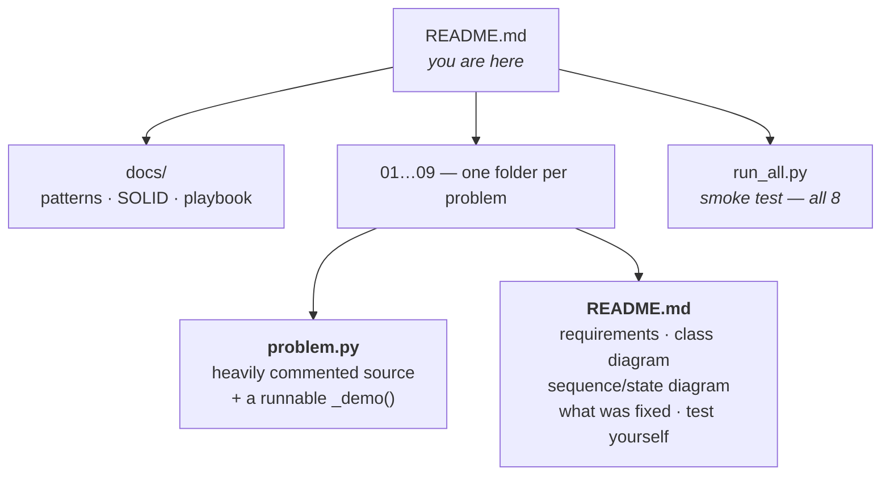

# Low Level Design — a readable, runnable study repo

Nine classic LLD interview problems in Python. Every file **runs**, every
design decision has a **comment explaining why**, and every folder has a
**README with class diagrams** and a "test yourself" section.

> Forked and rewritten from [amitkumar2244/LowLevelDesign](https://github.com/amitkumar2244/LowLevelDesign).
> Python only. See [What changed](#what-changed-from-the-original) — it is more
> than you'd expect: **4 of the 8 Python files in the original were empty**, and
> one C++ file was the wrong program entirely.

```bash
git clone <this-repo> && cd LowLevelDesign
python run_all.py              # run all 9 designs end to end
python run_all.py chess        # or just one
```

No dependencies. Python 3.8+. Nothing to install.

---

## The nine designs

| # | Design | Difficulty | The one thing it teaches | Patterns |
|---|---|---|---|---|
| [01](01_parking_lot/) | **Parking Lot** | ★☆☆☆☆ | Find-and-claim must be **atomic** | Strategy · Factory · Singleton · Facade |
| [02](02_atm/) | **ATM** | ★★☆☆☆ | **Rollback** when a transaction half-fails | State machine · Singleton · Command · DI |
| [03](03_amazon_locker/) | **Amazon Locker** | ★★☆☆☆ | **Best-fit** allocation, not exact-fit | Strategy · Composite · Facade |
| [04](04_logger_system/) | **Logger System** | ★★★☆☆ | Why the pattern they *ask for* is the wrong one | CoR · Strategy · Observer · Decorator |
| [05](05_rate_limiter/) | **Rate Limiter** | ★★★☆☆ | Four algorithms, and **how each one fails** | Strategy · Factory · Facade |
| [06](06_splitwise/) | **Splitwise** | ★★★★☆ | Net balances, greedy settlement, **integer cents** | Strategy · Factory · Facade |
| [07](07_book_my_show/) | **BookMyShow** | ★★★★☆ | The **two-phase hold** — and that locks expire | Strategy · State · Facade · DI |
| [08](08_chess_game/) | **Chess** | ★★★★★ | **Pseudo-legal vs legal**, tested by simulation | Strategy · Command · Factory |
| [09](09_elevator_system/) | **Elevator System** 🆕 | ★★★★☆ | The nearest car is **not the soonest car** | State · Strategy · Observer · Facade |

### Shared notes

- **[Design patterns cheat sheet](docs/01-patterns-cheatsheet.md)** — only the
  patterns actually used here, each linked to working code
- **[SOLID with examples from this repo](docs/02-solid-principles.md)** — bad
  version vs. the version in these files
- **[LLD interview playbook](docs/03-interview-playbook.md)** — a 45-minute
  structure, the follow-up questions, and where each is answered

---

## How this repo is built



**Every `.py` file has the same shape**, so once you've read one you can
navigate any of them:

1. A **module docstring** — the problem, the requirements as a numbered table,
   the patterns used, and *the one big idea*
2. **Numbered section banners** (`SECTION 1`, `SECTION 2`, …) you can jump
   between
3. **Pattern tags** (`[1] STRATEGY`, `[2] FACTORY`) matching the docstring
4. Comments that explain **why**, not what — especially the trade-off that was
   considered and rejected
5. A **runnable `_demo()`** with numbered scenarios that print what they prove

Reading a design is one thing; watching it run is another. Every scenario in
every demo prints its own conclusion:

```
======================================================================
SCENARIO 2: THE DOUBLE-BOOKING BUG -- the headline fix
======================================================================
  Alice CONFIRMED A1 (booking BK1)
  ...0.3s later, the lock's TTL has expired...
  Bob refused: seat A1 is already sold for this show
  ^ because the SALE is recorded in show.booked_seats, which
    has no TTL. The lock expiring cannot un-sell a seat.
```

---

## Suggested reading order

**If you're learning the patterns**, go in order — `01` is deliberately the
simplest and each one adds an idea.

**If you're prepping for an interview next week**, read
[the playbook](docs/03-interview-playbook.md) first, then `07` and `08`. They
are the two that generate the hardest follow-up questions.

**If you want the interesting algorithms**, go straight to `05` (four rate
limiters and their failure modes), `06` (greedy debt settlement), `08`
(move generation + check detection) and `09` (three dispatch policies, ranked
by a benchmark rather than by argument).

---

## What changed from the original

The upstream repo is a good set of skeletons. But it had gaps that make it hard
to learn from, so this fork closes them.

### The Python files that weren't there

| Design | Upstream `.py` | Here |
|---|---|---|
| ATM | 193 lines ✅ | rewritten + fixed |
| BookMyShow | 169 lines ✅ | rewritten + fixed |
| ParkingLot | 150 lines ✅ | rewritten + fixed |
| Splitwise | 90 lines, **core methods were `pass`** | implemented |
| **AmazonLocker** | **0 bytes** ❌ | ported from the C++ |
| **ChessGame** | **0 bytes** ❌ | ported from the C++ |
| **RateLimiter** | **0 bytes** ❌ | ported from the C++ |
| **LoggerSystem** | **0 bytes** ❌ — *and `loggersystem.cpp` was a copy-paste of the Amazon Locker code, so there was no logger anywhere in the repo* | written from scratch |

### The bugs

Every fix is documented **inline, at the code it fixes**, and summarised in
each folder's README. The ones worth knowing:

| Design | Bug | Why it matters |
|---|---|---|
| **BookMyShow** | A confirmed sale was recorded **only as a lock**. Locks have a TTL. Five minutes after every successful booking the seat became re-bookable | 💥 **Double-booking on every sale.** Permanent facts never live in something with a TTL |
| **Chess** | `getValidMoves()` returned `{}` for all six pieces | There were **no rules at all** — a pawn could move to h8 |
| **Chess** | `undo()` restored the squares but not `has_moved` | Legality testing undoes constantly, so this corrupted every piece within a few turns |
| **Chess** | Moves pushed to *two* histories; undo popped one | The two diverge on the first undo |
| **Rate Limiter** | Token bucket refilled by integer window division | Not a token bucket — a fixed window with extra steps. Plus a silent rate drift from discarding the elapsed remainder |
| **Rate Limiter** | Wall-clock time | NTP/DST jumps hand out free quota resets |
| **Amazon Locker** | `locker.size == package.size` | A SMALL package refused while LARGE lockers sit empty |
| **Amazon Locker** | OTP was the literal string `"1234"`, compared with `==`, unlimited attempts | Not an OTP — a shared password, with a timing side-channel |
| **ATM** | Debited the account, *then* dispensed, no rollback | Customer's money vanishes if anything fails in between |
| **ATM** | `Keypad` called `input()` directly | The program hangs; the whole ATM is untestable |
| **Splitwise** | `simplify_debt()` was `pass`; the balance sheet was never updated | The app tracked nothing |
| **Splitwise** | Money as `float` | `0.1 + 0.2 != 0.3` — cents evaporate |
| **Parking Lot** | No locking; leaky singleton; `-1` sentinel returns | Two cars, one spot |

### The ninth design

`01`–`08` are rewrites of the upstream problems.
[`09_elevator_system`](09_elevator_system/) is **new** — the classic LLD
question the original set leaves out, and the only one here whose central bug
is not a race or a rounding error but a *policy that is merely plausible*. It
ships with a seeded benchmark, because the naive dispatcher and the good one
both work, and only a measurement separates them. The first "smart" cost model
written for it lost to the dumb one; the benchmark is what caught that, and
[the folder README](09_elevator_system/#the-bug-i-wrote-and-how-the-benchmark-caught-it)
shows the numbers.

### What was added

- **Runnable demos** — `python run_all.py` exercises all 9, including the
  concurrency scenarios (10 threads racing for one seat, 20 threads hammering
  one rate limiter)
- **Diagrams** — class, sequence, state and flow diagrams in Mermaid, which
  GitHub renders natively
- **Type hints and docstrings** throughout
- **"Test yourself"** questions at the end of every folder README, and a
  **"Your notes"** section to write in
- **Thread safety** where the problem calls for it, with a comment saying what
  race it prevents

---

## A note on the comments

The comments here explain **why**, not what. `# increment the counter` is
noise; this is the kind of comment you'll find instead:

```python
# CEILING DIVISION. The original wrote this as `-(-x // 3600)`, the
# classic integer trick -- correct, but write-only code. math.ceil
# says the same thing in English. Parking 61 minutes bills 2 hours.
hours = math.ceil(seconds / 3600)
```

Where a design decision has a real trade-off, the comment states **both
sides** and says which one was taken — because in an interview you will be
asked, and "I picked fail-open because a config typo shouldn't take the site
down" is the answer that lands.

---

## License

Original structure from
[amitkumar2244/LowLevelDesign](https://github.com/amitkumar2244/LowLevelDesign).
Rewritten Python, documentation and diagrams in this fork are free to use.
