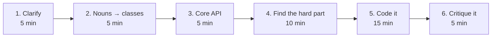

# LLD interview playbook

A repeatable 45-minute structure, plus the follow-up questions that actually
decide the outcome.

---

## The 45-minute structure



### 1. Clarify (5 min) — do not skip this

Ask about **scale, concurrency, and persistence** before you draw anything.
Three questions that change the whole design:

- *"Single process or many servers?"* → decides whether a `dict` + `Lock` is
  enough, or you need Redis (`07_book_my_show`)
- *"How many of X?"* → decides whether O(n) search is fine (`03_amazon_locker`)
- *"What happens if this fails halfway?"* → decides whether you need rollback
  (`02_atm`)

State your assumptions out loud and write them down. An interviewer who wanted
something different will correct you in 10 seconds — which is much cheaper than
finding out at minute 30.

### 2. Nouns → classes (5 min)

Read the problem statement and underline the nouns. Parking lot, floor, spot,
vehicle, ticket, gate. Those are your classes. Verbs become methods.

Use **enums, not strings**, for anything with a closed set of values. A typo
like `"conirmed"` silently means "not confirmed" and no tool can catch it.
If the values have a natural **order** (log levels, locker sizes), use
`IntEnum` — comparisons then become `a <= b` instead of a lookup table.

### 3. Core API (5 min)

Write the two or three method signatures the whole design hangs off, before
writing any bodies:

```python
def park_vehicle(self, vehicle: Vehicle) -> Optional[Ticket]: ...
def unpark_vehicle(self, ticket_id: str, is_subscriber: bool) -> float: ...
```

If those read well, the design is probably fine. If they need six parameters,
something is in the wrong class.

### 4. Find the hard part (10 min) — this is where the interview is won

**Every one of these problems has exactly one interesting part.** Everything
else is bookkeeping. Find it and spend your time there:

| Problem | The bookkeeping | **The actual problem** |
|---|---|---|
| Parking Lot | floors, spots, tickets | **find-and-claim must be atomic** |
| ATM | menus, screens, card reader | **rollback when a withdrawal half-fails** |
| Amazon Locker | bookings, notifications | **best-fit allocation, not exact-fit** |
| Logger | levels, formatters | **fan-out + not blocking the caller** |
| Rate Limiter | tiers, config | **which algorithm, and its failure mode** |
| Splitwise | users, groups, expenses | **net balances + greedy settlement + cents** |
| BookMyShow | theatres, screens, seats | **the two-phase hold, and that locks expire** |
| Chess | board, pieces, players | **pseudo-legal vs legal, tested by simulation** |

If you find yourself writing a fourth getter, you are in the bookkeeping.
Move.

### 5. Code it (15 min)

Code the hard part properly and **stub the rest** — say "assume a standard
repository here" and move on. A correct, tested hard part with stubs around it
beats a complete set of getters every time.

### 6. Critique it (5 min)

Volunteer the weaknesses before you are asked. This is the single highest-value
five minutes:

- *"This is O(n); at 10,000 lockers I'd keep a heap per size."*
- *"This lock is per-process; with 20 servers I'd move to Redis SET NX PX."*
- *"Greedy settlement gives ≤ n−1 transfers. The true optimum is NP-hard."*
- *"I've left out castling; it needs the king and rook unmoved and the king not
  passing through an attacked square."*

Naming what you left out and why is worth more than silently omitting it.

---

## The follow-up questions, and where each is answered

These come up in almost every LLD interview. Each links to a file where the
answer is written out.

| Question | Go read |
|---|---|
| *"Two users do this at the same instant. What happens?"* | [`01`](../01_parking_lot/) find-and-claim under one lock · [`07`](../07_book_my_show/) atomic `try_lock` |
| *"This fails halfway through. Now what?"* | [`02`](../02_atm/) reserve → debit → release-on-failure |
| *"How do you test this?"* | [`02`](../02_atm/) `ScriptedKeypad` · [`04`](../04_logger_system/) `MemoryAppender` · [`03`](../03_amazon_locker/) `FixedOTPGenerator` |
| *"Now run it on 20 servers."* | [`07`](../07_book_my_show/) `LockProvider` is already an interface |
| *"Add a new rule/type."* | [`01`](../01_parking_lot/) add a Strategy subclass, edit nothing |
| *"Why that data structure?"* | [`05`](../05_rate_limiter/) deque vs list · [`06`](../06_splitwise/) heap · [`03`](../03_amazon_locker/) IntEnum |
| *"Is that optimal?"* | [`06`](../06_splitwise/) greedy vs NP-hard |
| *"What about money/rounding?"* | [`06`](../06_splitwise/) integer cents |
| *"Why not a Singleton here?"* | [`08`](../08_chess_game/) one game vs a server of games |

---

## Five habits that separate good from adequate

**1. Inject anything slow, external, random, or clock-dependent.**
`Keypad`, `LockProvider`, `PaymentGateway`, `OTPGenerator`. This is what makes
your design testable, and untestable designs rot. See
[SOLID → D](02-solid-principles.md#d--dependency-inversion).

**2. Never return a magic sentinel.** `-1` for "not found" means every caller
must remember to check, and the one who forgets adds −1 to the day's revenue.
Raise instead — an exception cannot be ignored by accident. *Return a value for
expected outcomes; raise for broken preconditions.*

**3. Money is an integer number of cents.** `0.1 + 0.2 != 0.3`. Every real
payments system stores minor units. See [`06`](../06_splitwise/).

**4. Monotonic clock for durations, wall clock for timestamps.** NTP and DST
make wall clock jump backwards. A rate limiter on wall clock hands out free
resets. See [`05`](../05_rate_limiter/).

**5. Permanent facts never live in something with a TTL.** A lock, a cache
entry, a session — none of them are a system of record. This is the exact bug
in [`07`](../07_book_my_show/): a sale recorded only as a lock became
re-bookable five minutes later.

---

## Things that sound smart and are not

- **Reciting patterns you didn't use.** "I'll use the Visitor pattern here"
  when nothing visits anything is a red flag, not a green one.
- **Making everything a Singleton.** It is a global variable in a costume. Use
  it when the thing is genuinely unique in the process.
- **Adding interfaces with one implementation and no second one in sight.**
  Abstraction has a cost; pay it when you can name the second implementation.
- **Claiming optimality.** If you are not sure, say "greedy, and I believe the
  exact version is harder — let me think about the bound".
- **Skipping the failure modes.** "And then we save it to the database" is
  where the interviewer starts asking what happens when that call times out.
